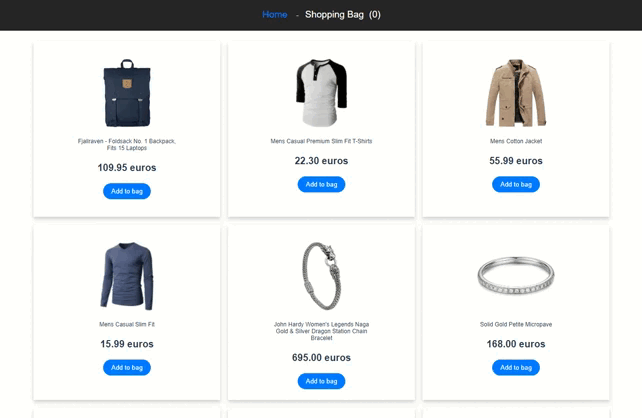

# e-commerce-project

E-commerce website project, made in Vue Js (CLI) with a VueX environment and architecture, using Vue Router and powered via api calls.

You can add the items of your choice to your cart, delete them / modify the quantity and the amount of your cart is automatically calculated.

 &nbsp;
 &nbsp;
 &nbsp;

## Project setup
```
npm install
```

### Compiles and hot-reloads for development
```
npm run serve
```

## Preview 


